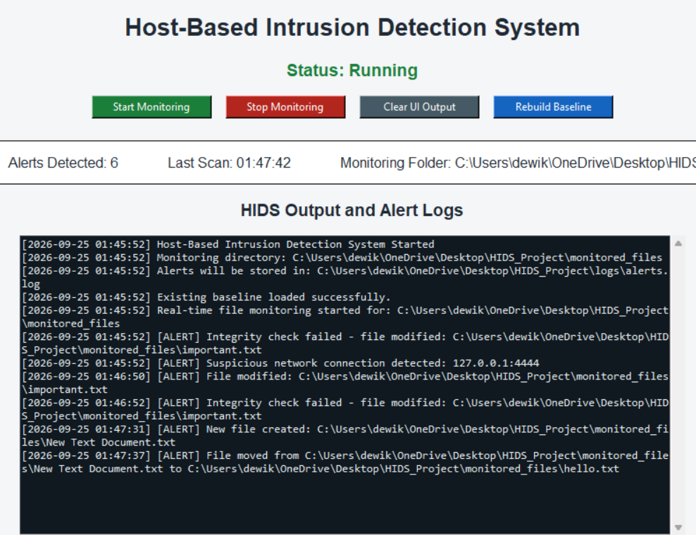
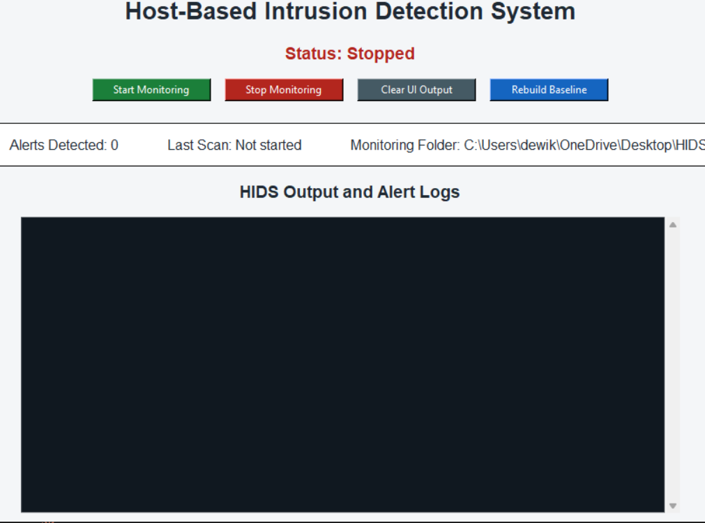
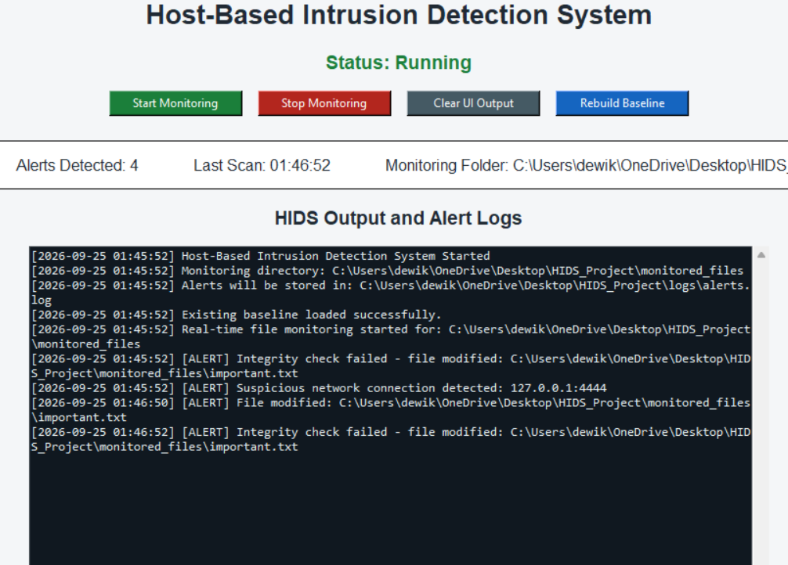
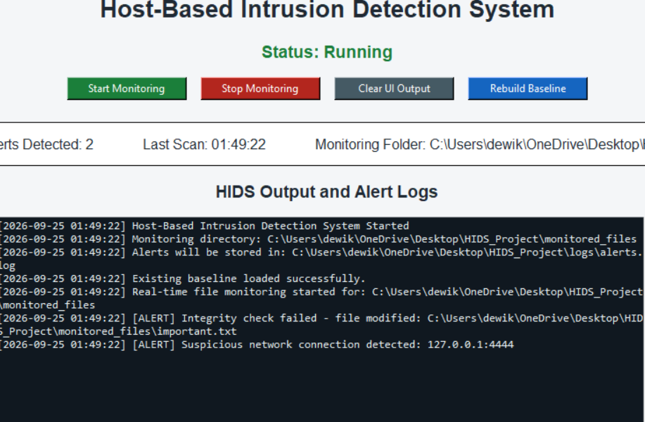
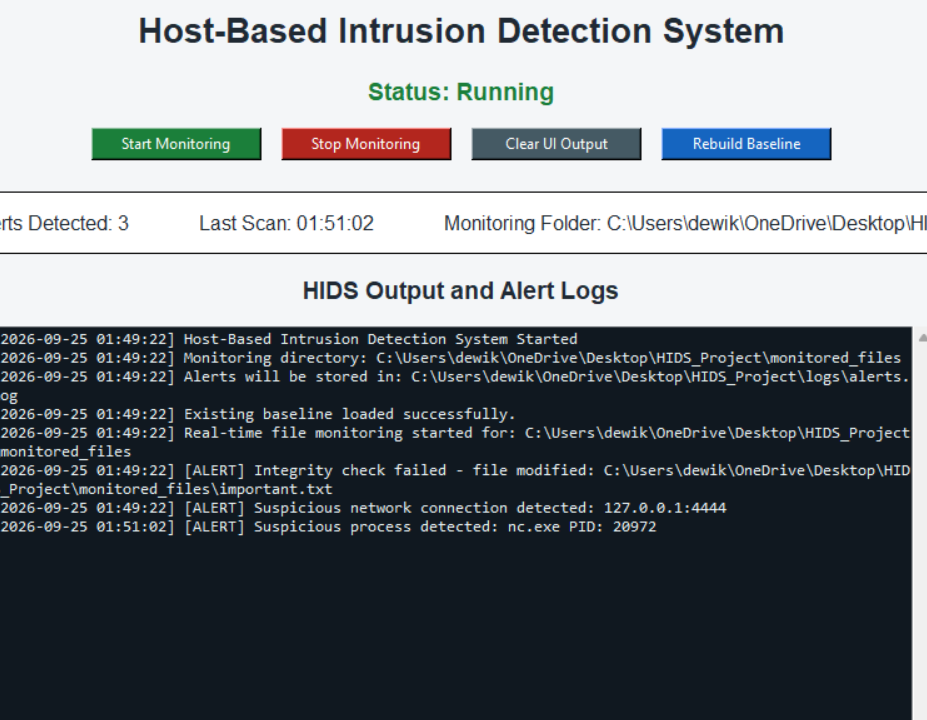
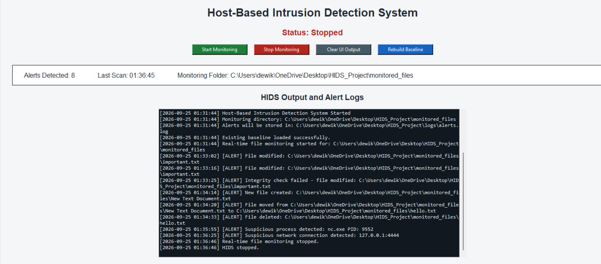
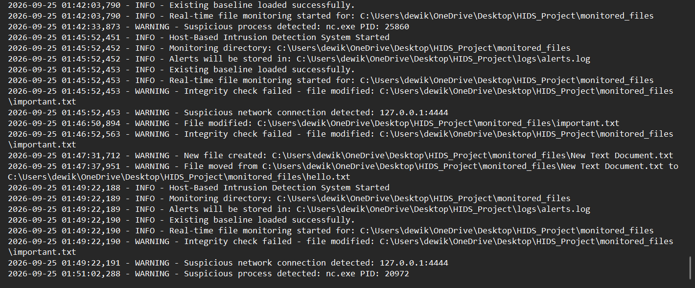

# Host-Based Intrusion Detection System (HIDS)

A lightweight Python HIDS that watches a Windows host for signs of compromise.
It checks file integrity, running processes and network connections, and reports
alerts in real time through a desktop dashboard or a command-line interface.




## Features

| Detection layer | How it works |
|---|---|
| **File Integrity Monitoring (FIM)** | Builds a SHA-256 baseline of every file in `monitored_files/` and re-checks it every 10 seconds to catch modified or deleted files. |
| **Real-time file events** | Uses `watchdog` to report files as they are created, modified, deleted or moved. |
| **Process monitoring** | Flags known malicious or attacker tools (for example `mimikatz.exe`, `nc.exe`, `meterpreter.exe`) by exact process name, and reports the PID. |
| **Network monitoring** | Flags outbound connections to ports that reverse shells and backdoors often use (4444, 5555, 6666, 31337). |
| **Alert logging** | Writes every event with a timestamp to `logs/alerts.log` so it can be reviewed later. |
| **Alert de-duplication** | Reports each incident once, not on every scan. |

## Architecture

```
            +-----------------------------+
            |   Tkinter dashboard / CLI   |
            +--------------+--------------+
                           |  thread-safe queue
      +--------------------+--------------------+
      |                    |                    |
+-----v------+     +-------v-------+     +------v-------+
| File layer |     | Process layer |     | Network layer|
| SHA-256 +  |     |    psutil     |     |    psutil    |
| watchdog   |     |               |     |              |
+-----+------+     +-------+-------+     +------+-------+
      +--------------------+--------------------+
                           |
                   logs/alerts.log
```

Scans run on a background thread. Results reach the UI through a `queue.Queue`,
so the Tkinter window stays responsive and is only updated from the main thread.

## Getting started

```bash
git clone https://github.com/dewikbavishi-alt/HIDS_Project.git
cd HIDS_Project
pip install -r requirements.txt
```

**Dashboard version**

```bash
python hid_ui.py
```

**Command-line version**

```bash
python hids.py
```

> Run the terminal as **Administrator** so the network monitor can see every connection.

## Try it out

1. Put a few files in `monitored_files/` and click **Start Monitoring**. The first run records their hashes as the trusted baseline.
2. **File tampering:** edit or delete one of those files. An integrity alert appears.
3. **Suspicious process:** copy a harmless program and name the copy `nc.exe`, then run it. A process alert appears within 10 seconds:
   ```powershell
   Copy-Item C:\Windows\System32\PING.EXE $env:TEMP\nc.exe
   & $env:TEMP\nc.exe -t 127.0.0.1
   ```
4. **Suspicious port:** open a local connection on port 4444 and keep it open. A network alert appears within 10 seconds:
   ```powershell
   $l = [System.Net.Sockets.TcpListener]::new([System.Net.IPAddress]::Loopback, 4444); $l.Start()
   $c = [System.Net.Sockets.TcpClient]::new('127.0.0.1', 4444)
   ```
5. After a legitimate change, click **Rebuild Baseline** to mark the current files as trusted.

## Screenshots and test results

These screenshots come from a test run on Windows 11 that used the steps in [Try it out](#try-it-out).

### 1. Idle state


This is the dashboard before monitoring starts. The status is **Stopped**, the alert counter is 0 and the log is empty. The four controls are Start, Stop, Clear output and Rebuild baseline.

### 2. File integrity violation and suspicious connection


On startup the HIDS loads the saved SHA-256 baseline and finds that `important.txt` no longer matches its trusted hash. It also finds an open connection to port **4444**, the default port for Metasploit reverse shells. When the file is edited again, the real-time monitor (`watchdog`) reports it immediately and the next hash check confirms the change.

### 3. File creation and rename


A new file dropped into the protected folder is reported at once. Renaming it (`New Text Document.txt` to `hello.txt`) produces a **File moved** alert with the old and new paths. Attackers often drop and rename files like this when staging a payload.

### 4. Persistence across restarts


After a restart the tool still remembers what is trusted, because the baseline is stored on disk. The tampered file and the suspicious connection are both detected again within the first scan.

### 5. Suspicious process detection


A harmless program was copied and named `nc.exe` (Netcat, a tool attackers use for backdoors and reverse shells). The process monitor matched the name exactly and reported its **PID**, so an analyst could investigate or end it.

### 6. Full test session


This is one complete session from start to stop, with **8 alerts** covering every detection layer: file modification, integrity failure, creation, rename, deletion, a suspicious process and a suspicious network connection. After **Stop Monitoring** the file monitor shuts down cleanly.

### 7. Persistent alert log


Every event is also written to `logs/alerts.log` with a millisecond timestamp. Alerts are logged at `WARNING` level and status messages at `INFO` level, so they can be reviewed later or sent to a SIEM.

## Configuration

Edit these lists at the top of `hids.py` or `hid_ui.py`:

```python
SUSPICIOUS_PROCESSES = ["keylogger.exe", "trojan.exe", "meterpreter.exe", "nc.exe", ...]
SUSPICIOUS_PORTS = [4444, 5555, 6666, 31337]
```

## Project structure

```
HIDS_Project/
├── hid_ui.py          # Tkinter dashboard
├── hids.py            # Command-line version
├── requirements.txt
├── docs/              # Screenshots
├── monitored_files/   # Files to protect
└── logs/alerts.log    # Created at runtime
```

## Limitations and future work

- Detection by process name is easy to evade by renaming a file. Next step: match processes by executable hash.
- The baseline file is not protected, so an attacker could rewrite it. Next step: sign it or keep it off the host.
- Planned: email or Slack notifications, YARA rule scanning, Windows Event Log analysis, and export to a SIEM such as Splunk or the ELK Stack.

## Tech stack

Python · psutil · watchdog · hashlib (SHA-256) · Tkinter · threading · logging

## License

MIT
